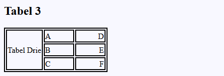

# Oefenreeks 02 Werken met tabellen
## Oefening A

### OPGAVE/ STAPPEN

* Start met een lege folder als uitgangspunt voor je uitwerking

Voer volgende stappen uit met een editor naar keuze.

* Maak een nieuwe webpagina en noem deze **index.html**
* Voeg een titel toe aan je webpagina: **Tabellen** 
* Koppel een stylesheet aan je pagina en zorg ervoor dat deze zich in een *passende folder* bevindt binnen je uitwerking.
* Maak gebruik van de iconen die je terugvindt in de images folder om op een passende manier een icon toe te voegen aan het tabblad van je pagina.
* Voeg een h1 element toe op je pagina waarin je de tekst *Oefeningen op tabellen* plaatst.
* Laat elke nieuwe uitwerking van een tabel voorafgaan door een h2 element. Plaats de naam van de tabel (referentie) steeds in deze hoofding.
  
#### TABEL 1 
* Maak een nieuwe tabel aan met volgende eigenschappen:
  * De tabel heeft **2 rijen**.
  * De tabel heeft **3 kolommen**.
  * De inhoud van de cellen *(van links naar rechts)* bestaat uit de eerste zes letters van het alfabet *(1 letter per cel)*
  * Voorzie de tabel van de nodige opmaak via CSS. Denk eraan dat we zo meteen nog tabellen op de pagina zullen plaatsen die andere opmaak vereisten kunnen hebben.
* In alle cellen in de eerste kolom wordt de inhoud **links uitgelijnd**. 
* In alle cellen van de tweede kolom wordt de inhoud **centraal uitgelijnd**.
* In alle cellen van de derde kolom wordt de inhoud **rechts uitgelijnd**.
* De breedte van een data cel wordt bepaald op **55 pixels**.
* De tabel en elke cel in de tabel heeft een border *(volle lijn)* met volgende eigenschappen:
  * **Breedte:** 2 pixels
  * **Kleur:** zwart 
  
##### VOORBEELD UITWERKING 

 
 
 
 
#### TABEL 2
* Kopieer tabel 1 als basis om op verder te werken.
* Voeg een nieuwe rij toe bovenaan deze tabel. Deze rij heeft volgende eigenschap:
  * De tekst van deze rij *(“Tweede tabel”)* zal zich overheen de drie kolommen spreiden. 

##### VOORBEELD UITWERKING 

 
#### TABEL 3 
* Kopieer tabel 1 als basis om op verder te werken.
* Bekijk het uitgewerkte voorbeeld en werk tabel 3 uit zodat je eindresultaat in dezelfde lijn van dit voorbeeld ligt. 

##### VOORBEELD UITWERKING 

#### TABEL 4 
* Kopieer tabel 1 als basis om op verder te werken.
* Voeg een extra rij toe en voorzie de inhoud van de cellen van de letters uit het alfabet die aansluiten op de tweede rij.
* Via CSS zorg je ervoor dat de volledige rij in een andere achtergrondkleur oplicht wanneer je er met je cursor overheen gaat. 

##### VOORBEELD UITWERKING 

